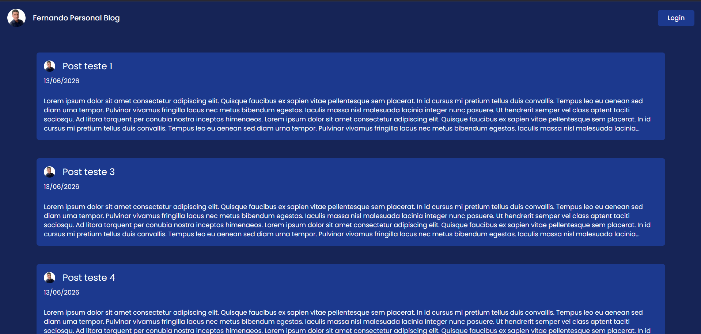
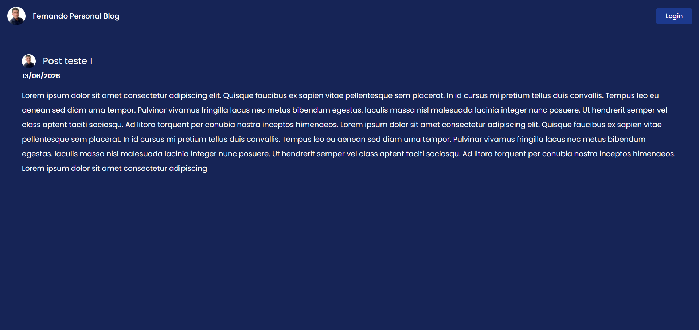
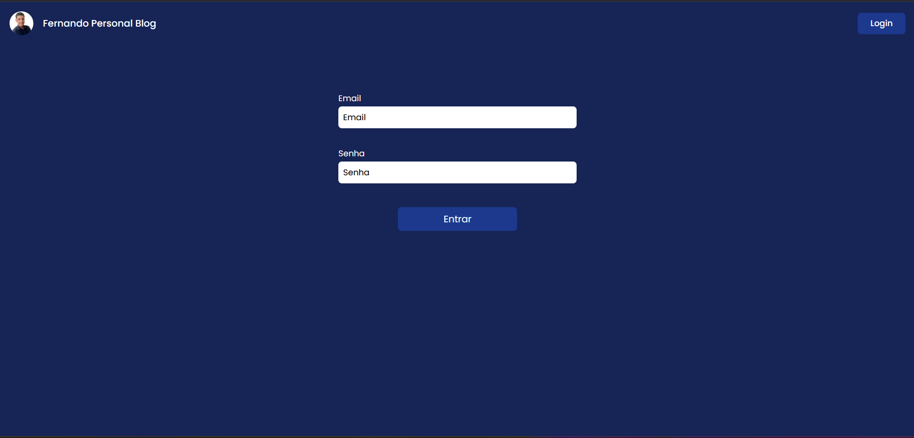
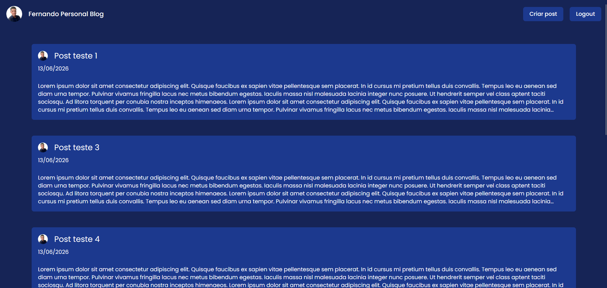
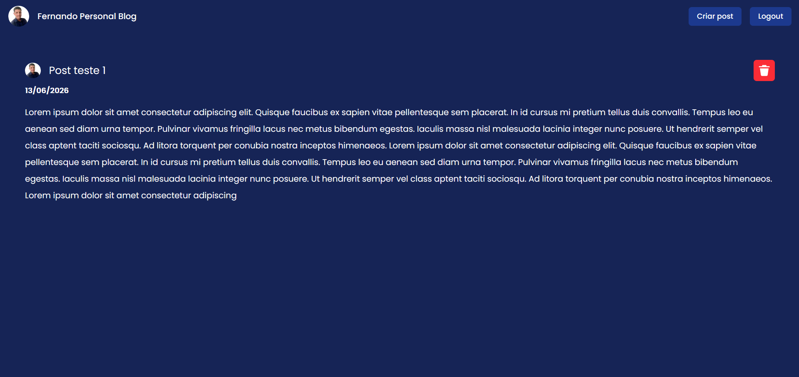
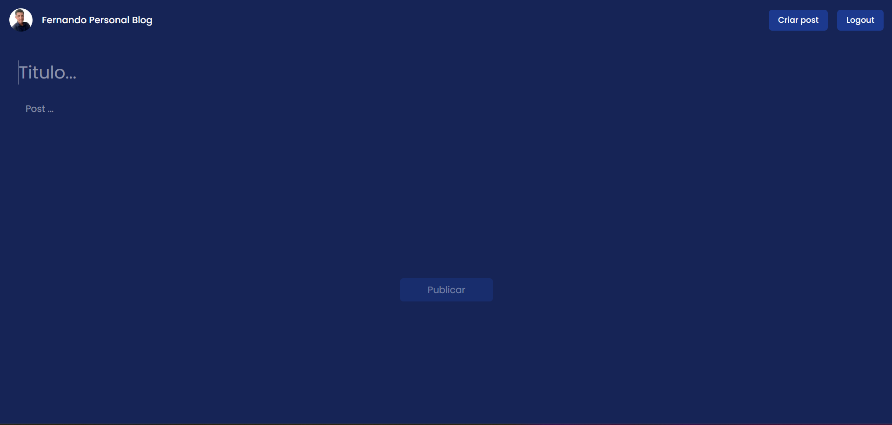

# Fernando Personal Blog

O meu blog pessoal feito com Next JS

## Não autenticado

### Página inicial

### Página de informações do post

### Página de login

 
 
 
 

# Autenticado (Admin)

### Página inicial

### Página de informações do post

### Página de criação de post

 
 

## Tecnologias usadas no projeto
- Next JS
- Prisma
- TailwindCSS
- PostgreSQL

Link: https://fb-personal-blog.vercel.app/